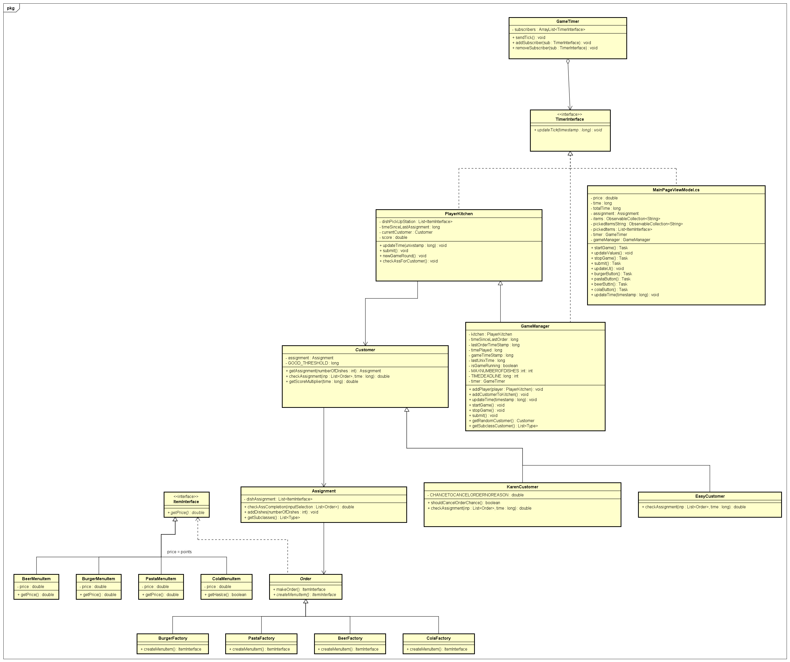
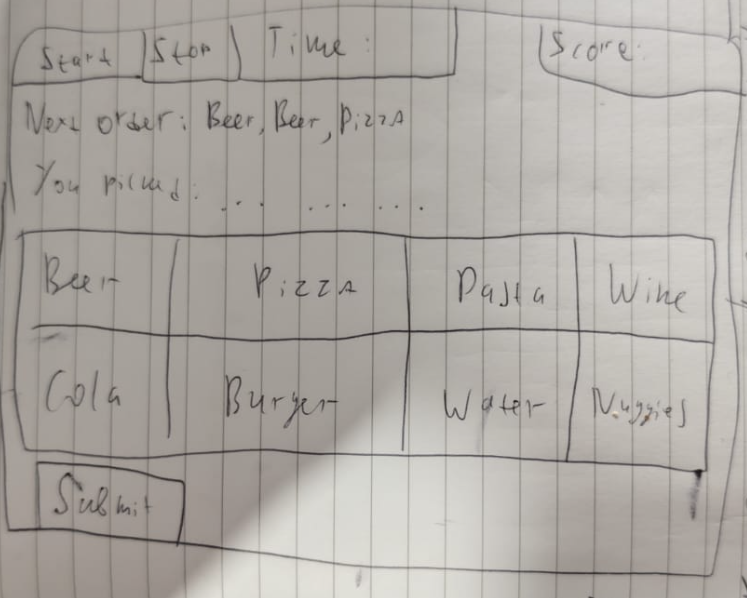

# Startdocument Patterns of Sale (Cafe Game)
Assignment carried out by 3rd year NHL Stenden students:
* Corvin Wittmaack
* Mathew Shardin
* Rob Veldman
## Introduction
The team is set out to create a small video game, where a player takes control of a cafe kitchen. The idea is loosely inspired by Papa's Kitchen game series. Patterns of Sale is a game that allows one to learn to use a touch screen/mouse, improve hand-eye coordination and reaction times as well as practice fine mouse to improve aim in shooter games. 
The game is based around a player cooking (choosing) the correct dishes to satisfy a customer's order.
## Application description
##### Main game loop:
1. Recieve a randomly generated order (assignment) from one of the customers. The tickets with dishes appear on top.
2. Choose the correct dishes from the dish catalogue closing each ticket to satisfy the order. Don't forget to send it in to the customer!
3. Recieve a score based on the order completed. Faster cooks get more points, while snails can actually lose them if an order isn't sent in time (10 seconds)!
4. Repeat steps 1-3
5. ?????? 
6. PROFIT!

##### Game features:
* Different types of customers that asses the player's orders differently
* High-score based game. Players get score per each order fullfill
* GUI to interact with the game
* High paced gameplay!
* The game is fully generic! To throw new dishes in the mix, one can simply extend the Factory Design Pattern by adding a new Menu Item that implements the ItemInterface and a corresponding Factory that is a child of the Order class.

##### Additional information
Customer types:
* Normal Customer - evaluates the order by combining the score price of each correctly picked dish and subracting the score price of incorrectly added dishes
* Karen Customer - works the same way as normal customer, but has a 50% chance to get mad and invalidate the whole order (grant 0 score points)

Extra Sauce Rules:
* Score Multipliers: the faster an order is sent in, the more points are granted. The multiplier range is times 0.5 - 2.0 of the normal score. The time threshhold is 3 seconds.
* Customers Have Limited Patience: if a player cannot send an order in within 10 seconds, the order is cancelled and points are lost.
* Maxiumum Number of Tickets: 10

Development Language: C#
GUI Framework: .NET MAUI using MVVM

## Moscow Analysis
| **Priority**  | **Items**                                                                                                                |
|---------------|--------------------------------------------------------------------------------------------------------------------------|
| Must Have     | GUI   Basic game loop of picking dishes based on order                                                             |
| Should Have   | Images for all dishes   Different Types of customers that change their order evaluation   High score tracker    |
| Could Have    | Game sounds   Dynamic GUI Buttons based on Factory Method                                                                                                           |
| Will Not Have | Multiplayer mode                                                                                                      |

## Class Diagram

## Design Patterns

#### Factory Method
A factory method is used to make the actual dish objects without relying on passing parameters to some method. Additionally, the factory method allows developers to add new dishes to the game more easily. When a new Concrete Product (Implements ItemInterface) and Factory (Extends Order) are added, those dishes will automatically appear in the randomly generated Assignments (orders).
#### Template Method
Different customer types (so far only Karen and Easy customer are present) mix up the gameplay! Each of the customers has their own implementation of the CheckAssignment methods (The method decides the number of score points to be granted for a completed/incompleted order) that affect how orders are assessed.
#### Observer
The GameTimer class keeps the game loop running. Parameters inside of it also define the speed of one gametick (default is 1 second). The GameTimer sends out a current timestamp in UNIX time format. Each of the listener uses that timestamp in their own way.
The subscribes include: PlayerKitchen, GameManager and ViewModel
#### Singleton
The application uses a built-in implementation of the Singleton for GameManager and GameTimer. Dependency Injection is used to access those two single instances globally.

## GUI Wireframes

