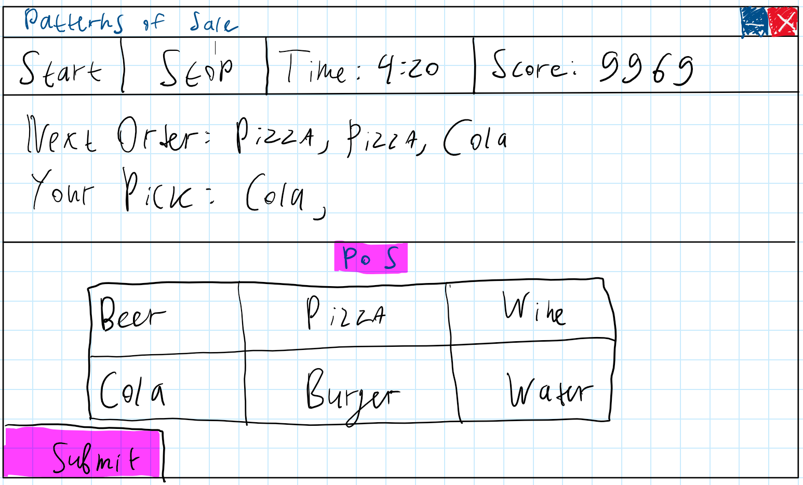

# Startdocument Patterns of Sale (Cafe Game)
Assignment carried out by 3rd year NHL Stenden students:
* Corvin Wittmaack
* Mathew Shardin
* Rob Veldman
## Introduction
The team is set out to create a small video game, where a player takes control of a cafe kitchen. The idea is loosely inspired by Papa's Kitechen game series. Patterns of Sale is a game that allows one to learn to use a touch screen/mouse, imporve hand-eye coordination and reaction times. The game is based around a player cooking (choosing) the correct dishes to satisfy a customer's order
## Application description
##### Main game loop:
1. Recieve an order (assignment) from one of the customers
2. Choose the correct dishes from the dish catalogue to satisfy the order and send them in to the customer
3. Recieve a score based on the order completed
4. Repeat steps 1-3
5. ??????
6. PROFIT!

##### Game features:
* Different types of customers that asses the player's orders differently
* High-score based game. Players get score per each order fullfill
* GUI to interact with the game

##### Additional information
Customer types:
* Normal Customer - evaluates the order by combining the score price of each correctly picked dish and subracting the score price of incorrectly added dishes
* Karen Customer - works the same way as normal customer, but has a 50% chance to get mad and invalidate the whole order (grant 0 score points)

Development Language: C#
GUI Framework: .NET MAUI

## Moscow Analysis
| **Priority**  | **Items**                                                                                                                |
|---------------|--------------------------------------------------------------------------------------------------------------------------|
| Must Have     | GUI   Basic game loop of picking dishes based on order                                                             |
| Should Have   | Images for all dishes   Different Types of customers that change their order evaluation   High score tracker    |
| Could Have    | Game sounds                                                                                                           |
| Will Not Have | Multiplayer mode                                                                                                      |

## Class Diagram

## GUI Wireframes

